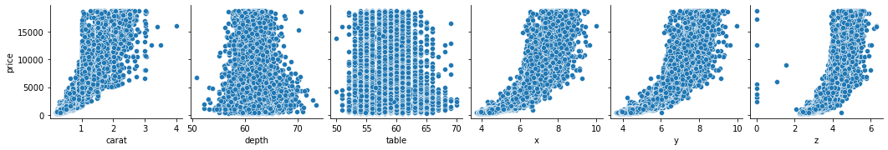

# DIAMOND PRICE PREDICTION

ismailsavruk@gmail.com © 2022

In this project, I will analyze diamonds dataset and build Machine Learning models to predict price values by their cut, color, clarity, dimensions and other attributes.

Dataset from: https://www.kaggle.com/datasets/shivam2503/diamonds

## 1. Importing  Libraries and Loading Dataset

Let's start by importing necessary libraries first.


```python
# Load libraries
import numpy as np
import pandas as pd
from pandas import read_csv
from pandas.plotting import scatter_matrix
import seaborn as sns
import matplotlib as mpl
import matplotlib.pyplot as plt
import matplotlib.pylab as pylab

%matplotlib inline

from sklearn.model_selection import train_test_split
from sklearn.model_selection import cross_val_score
from sklearn.metrics import classification_report
from sklearn.metrics import confusion_matrix
from sklearn import linear_model

from sklearn.preprocessing import StandardScaler, MinMaxScaler
from sklearn.decomposition import PCA
from sklearn.pipeline import Pipeline
from xgboost import XGBRegressor
from sklearn import metrics

from sklearn.ensemble import GradientBoostingRegressor
from catboost import CatBoostRegressor
from sklearn.kernel_ridge import KernelRidge
from xgboost.sklearn import XGBRegressor
from lightgbm import LGBMRegressor
from sklearn.linear_model import LinearRegression, Lasso, Ridge, BayesianRidge, SGDRegressor, ElasticNet
from sklearn.tree import DecisionTreeRegressor
from sklearn.svm import SVR, LinearSVR
from sklearn.neighbors import KNeighborsRegressor
from sklearn.ensemble import RandomForestRegressor

from sklearn.metrics import mean_absolute_error, mean_squared_error, r2_score
from sklearn.model_selection import RepeatedKFold
from sklearn.model_selection import RandomizedSearchCV

import warnings
warnings.filterwarnings('ignore')
```


```python
# Load dataset
diamonds = pd.read_csv('Diamonds.csv')
```

Let's take a look at the dataset.


```python
diamonds
```


<div>

<table border="1" class="dataframe">
  <thead>
    <tr style="text-align: right;">
      <th></th>
      <th>Unnamed: 0</th>
      <th>carat</th>
      <th>cut</th>
      <th>color</th>
      <th>clarity</th>
      <th>depth</th>
      <th>table</th>
      <th>price</th>
      <th>x</th>
      <th>y</th>
      <th>z</th>
    </tr>
  </thead>
  <tbody>
    <tr>
      <th>0</th>
      <td>1</td>
      <td>0.23</td>
      <td>Ideal</td>
      <td>E</td>
      <td>SI2</td>
      <td>61.5</td>
      <td>55.0</td>
      <td>326</td>
      <td>3.95</td>
      <td>3.98</td>
      <td>2.43</td>
    </tr>
    <tr>
      <th>1</th>
      <td>2</td>
      <td>0.21</td>
      <td>Premium</td>
      <td>E</td>
      <td>SI1</td>
      <td>59.8</td>
      <td>61.0</td>
      <td>326</td>
      <td>3.89</td>
      <td>3.84</td>
      <td>2.31</td>
    </tr>
    <tr>
      <th>2</th>
      <td>3</td>
      <td>0.23</td>
      <td>Good</td>
      <td>E</td>
      <td>VS1</td>
      <td>56.9</td>
      <td>65.0</td>
      <td>327</td>
      <td>4.05</td>
      <td>4.07</td>
      <td>2.31</td>
    </tr>
    <tr>
      <th>3</th>
      <td>4</td>
      <td>0.29</td>
      <td>Premium</td>
      <td>I</td>
      <td>VS2</td>
      <td>62.4</td>
      <td>58.0</td>
      <td>334</td>
      <td>4.20</td>
      <td>4.23</td>
      <td>2.63</td>
    </tr>
    <tr>
      <th>4</th>
      <td>5</td>
      <td>0.31</td>
      <td>Good</td>
      <td>J</td>
      <td>SI2</td>
      <td>63.3</td>
      <td>58.0</td>
      <td>335</td>
      <td>4.34</td>
      <td>4.35</td>
      <td>2.75</td>
    </tr>
    <tr>
      <th>...</th>
      <td>...</td>
      <td>...</td>
      <td>...</td>
      <td>...</td>
      <td>...</td>
      <td>...</td>
      <td>...</td>
      <td>...</td>
      <td>...</td>
      <td>...</td>
      <td>...</td>
    </tr>
    <tr>
      <th>53935</th>
      <td>53936</td>
      <td>0.72</td>
      <td>Ideal</td>
      <td>D</td>
      <td>SI1</td>
      <td>60.8</td>
      <td>57.0</td>
      <td>2757</td>
      <td>5.75</td>
      <td>5.76</td>
      <td>3.50</td>
    </tr>
    <tr>
      <th>53936</th>
      <td>53937</td>
      <td>0.72</td>
      <td>Good</td>
      <td>D</td>
      <td>SI1</td>
      <td>63.1</td>
      <td>55.0</td>
      <td>2757</td>
      <td>5.69</td>
      <td>5.75</td>
      <td>3.61</td>
    </tr>
    <tr>
      <th>53937</th>
      <td>53938</td>
      <td>0.70</td>
      <td>Very Good</td>
      <td>D</td>
      <td>SI1</td>
      <td>62.8</td>
      <td>60.0</td>
      <td>2757</td>
      <td>5.66</td>
      <td>5.68</td>
      <td>3.56</td>
    </tr>
    <tr>
      <th>53938</th>
      <td>53939</td>
      <td>0.86</td>
      <td>Premium</td>
      <td>H</td>
      <td>SI2</td>
      <td>61.0</td>
      <td>58.0</td>
      <td>2757</td>
      <td>6.15</td>
      <td>6.12</td>
      <td>3.74</td>
    </tr>
    <tr>
      <th>53939</th>
      <td>53940</td>
      <td>0.75</td>
      <td>Ideal</td>
      <td>D</td>
      <td>SI2</td>
      <td>62.2</td>
      <td>55.0</td>
      <td>2757</td>
      <td>5.83</td>
      <td>5.87</td>
      <td>3.64</td>
    </tr>
  </tbody>
</table>
<p>53940 rows × 11 columns</p>
</div>


### Content

carat: weight of the diamond 

cut: quality of the cut (Fair, Good, Very Good, Premium, Ideal)

color: diamond colour, from J (worst) to D (best)

clarity: a measurement of how clear the diamond is (I1 (worst), SI2, SI1, VS2, VS1, VVS2, VVS1, IF (best))

table: width of top of diamond relative to widest point 

price: price in US dollars 

x: length in mm 

y: width in mm 

z: depth in mm 

depth: total depth percentage = z / mean(x, y) = 2 * z / (x + y)

Let's remove the index column since pandas has already one.


```python
diamonds.drop(['Unnamed: 0'], axis=1, inplace=True)
diamonds
```


<div>

<table border="1" class="dataframe">
  <thead>
    <tr style="text-align: right;">
      <th></th>
      <th>carat</th>
      <th>cut</th>
      <th>color</th>
      <th>clarity</th>
      <th>depth</th>
      <th>table</th>
      <th>price</th>
      <th>x</th>
      <th>y</th>
      <th>z</th>
    </tr>
  </thead>
  <tbody>
    <tr>
      <th>0</th>
      <td>0.23</td>
      <td>Ideal</td>
      <td>E</td>
      <td>SI2</td>
      <td>61.5</td>
      <td>55.0</td>
      <td>326</td>
      <td>3.95</td>
      <td>3.98</td>
      <td>2.43</td>
    </tr>
    <tr>
      <th>1</th>
      <td>0.21</td>
      <td>Premium</td>
      <td>E</td>
      <td>SI1</td>
      <td>59.8</td>
      <td>61.0</td>
      <td>326</td>
      <td>3.89</td>
      <td>3.84</td>
      <td>2.31</td>
    </tr>
    <tr>
      <th>2</th>
      <td>0.23</td>
      <td>Good</td>
      <td>E</td>
      <td>VS1</td>
      <td>56.9</td>
      <td>65.0</td>
      <td>327</td>
      <td>4.05</td>
      <td>4.07</td>
      <td>2.31</td>
    </tr>
    <tr>
      <th>3</th>
      <td>0.29</td>
      <td>Premium</td>
      <td>I</td>
      <td>VS2</td>
      <td>62.4</td>
      <td>58.0</td>
      <td>334</td>
      <td>4.20</td>
      <td>4.23</td>
      <td>2.63</td>
    </tr>
    <tr>
      <th>4</th>
      <td>0.31</td>
      <td>Good</td>
      <td>J</td>
      <td>SI2</td>
      <td>63.3</td>
      <td>58.0</td>
      <td>335</td>
      <td>4.34</td>
      <td>4.35</td>
      <td>2.75</td>
    </tr>
    <tr>
      <th>...</th>
      <td>...</td>
      <td>...</td>
      <td>...</td>
      <td>...</td>
      <td>...</td>
      <td>...</td>
      <td>...</td>
      <td>...</td>
      <td>...</td>
      <td>...</td>
    </tr>
    <tr>
      <th>53935</th>
      <td>0.72</td>
      <td>Ideal</td>
      <td>D</td>
      <td>SI1</td>
      <td>60.8</td>
      <td>57.0</td>
      <td>2757</td>
      <td>5.75</td>
      <td>5.76</td>
      <td>3.50</td>
    </tr>
    <tr>
      <th>53936</th>
      <td>0.72</td>
      <td>Good</td>
      <td>D</td>
      <td>SI1</td>
      <td>63.1</td>
      <td>55.0</td>
      <td>2757</td>
      <td>5.69</td>
      <td>5.75</td>
      <td>3.61</td>
    </tr>
    <tr>
      <th>53937</th>
      <td>0.70</td>
      <td>Very Good</td>
      <td>D</td>
      <td>SI1</td>
      <td>62.8</td>
      <td>60.0</td>
      <td>2757</td>
      <td>5.66</td>
      <td>5.68</td>
      <td>3.56</td>
    </tr>
    <tr>
      <th>53938</th>
      <td>0.86</td>
      <td>Premium</td>
      <td>H</td>
      <td>SI2</td>
      <td>61.0</td>
      <td>58.0</td>
      <td>2757</td>
      <td>6.15</td>
      <td>6.12</td>
      <td>3.74</td>
    </tr>
    <tr>
      <th>53939</th>
      <td>0.75</td>
      <td>Ideal</td>
      <td>D</td>
      <td>SI2</td>
      <td>62.2</td>
      <td>55.0</td>
      <td>2757</td>
      <td>5.83</td>
      <td>5.87</td>
      <td>3.64</td>
    </tr>
  </tbody>
</table>
<p>53940 rows × 10 columns</p>
</div>


### Rearranging Columns

Let's change the order of the columns and move the target column, price to the end.


```python
diamonds = diamonds[['carat', 'cut', 'color', 'clarity', 'depth', 'table', 'x', 'y', 'z', 'price']]
diamonds
```


<div>

<table border="1" class="dataframe">
  <thead>
    <tr style="text-align: right;">
      <th></th>
      <th>carat</th>
      <th>cut</th>
      <th>color</th>
      <th>clarity</th>
      <th>depth</th>
      <th>table</th>
      <th>x</th>
      <th>y</th>
      <th>z</th>
      <th>price</th>
    </tr>
  </thead>
  <tbody>
    <tr>
      <th>0</th>
      <td>0.23</td>
      <td>Ideal</td>
      <td>E</td>
      <td>SI2</td>
      <td>61.5</td>
      <td>55.0</td>
      <td>3.95</td>
      <td>3.98</td>
      <td>2.43</td>
      <td>326</td>
    </tr>
    <tr>
      <th>1</th>
      <td>0.21</td>
      <td>Premium</td>
      <td>E</td>
      <td>SI1</td>
      <td>59.8</td>
      <td>61.0</td>
      <td>3.89</td>
      <td>3.84</td>
      <td>2.31</td>
      <td>326</td>
    </tr>
    <tr>
      <th>2</th>
      <td>0.23</td>
      <td>Good</td>
      <td>E</td>
      <td>VS1</td>
      <td>56.9</td>
      <td>65.0</td>
      <td>4.05</td>
      <td>4.07</td>
      <td>2.31</td>
      <td>327</td>
    </tr>
    <tr>
      <th>3</th>
      <td>0.29</td>
      <td>Premium</td>
      <td>I</td>
      <td>VS2</td>
      <td>62.4</td>
      <td>58.0</td>
      <td>4.20</td>
      <td>4.23</td>
      <td>2.63</td>
      <td>334</td>
    </tr>
    <tr>
      <th>4</th>
      <td>0.31</td>
      <td>Good</td>
      <td>J</td>
      <td>SI2</td>
      <td>63.3</td>
      <td>58.0</td>
      <td>4.34</td>
      <td>4.35</td>
      <td>2.75</td>
      <td>335</td>
    </tr>
    <tr>
      <th>...</th>
      <td>...</td>
      <td>...</td>
      <td>...</td>
      <td>...</td>
      <td>...</td>
      <td>...</td>
      <td>...</td>
      <td>...</td>
      <td>...</td>
      <td>...</td>
    </tr>
    <tr>
      <th>53935</th>
      <td>0.72</td>
      <td>Ideal</td>
      <td>D</td>
      <td>SI1</td>
      <td>60.8</td>
      <td>57.0</td>
      <td>5.75</td>
      <td>5.76</td>
      <td>3.50</td>
      <td>2757</td>
    </tr>
    <tr>
      <th>53936</th>
      <td>0.72</td>
      <td>Good</td>
      <td>D</td>
      <td>SI1</td>
      <td>63.1</td>
      <td>55.0</td>
      <td>5.69</td>
      <td>5.75</td>
      <td>3.61</td>
      <td>2757</td>
    </tr>
    <tr>
      <th>53937</th>
      <td>0.70</td>
      <td>Very Good</td>
      <td>D</td>
      <td>SI1</td>
      <td>62.8</td>
      <td>60.0</td>
      <td>5.66</td>
      <td>5.68</td>
      <td>3.56</td>
      <td>2757</td>
    </tr>
    <tr>
      <th>53938</th>
      <td>0.86</td>
      <td>Premium</td>
      <td>H</td>
      <td>SI2</td>
      <td>61.0</td>
      <td>58.0</td>
      <td>6.15</td>
      <td>6.12</td>
      <td>3.74</td>
      <td>2757</td>
    </tr>
    <tr>
      <th>53939</th>
      <td>0.75</td>
      <td>Ideal</td>
      <td>D</td>
      <td>SI2</td>
      <td>62.2</td>
      <td>55.0</td>
      <td>5.83</td>
      <td>5.87</td>
      <td>3.64</td>
      <td>2757</td>
    </tr>
  </tbody>
</table>
<p>53940 rows × 10 columns</p>
</div>


```python
#shape
diamonds.shape
```


    (53940, 10)


```python
# Checking for missing values
diamonds.isna().sum()
```


    carat      0
    cut        0
    color      0
    clarity    0
    depth      0
    table      0
    x          0
    y          0
    z          0
    price      0
    dtype: int64


No missing values, great!


### Encoding

According to the information given in the dataset webpage:

- cut is the quality of the cut (Fair, Good, Very Good, Premium, Ideal)

- color is the diamond colour, from J (worst) to D (best)

- clarity is a measurement of how clear the diamond is (I1 (worst), SI2, SI1, VS2, VS1, VVS2, VVS1, IF (best))

So, let's use this info to convert nonnumeric categorical values to numeric ones. I will use map method instead of ordinal encoder. 


```python
diamonds['cut'] = diamonds['cut'].map({'Fair':0, 'Good':1, 'Very Good':2, 'Premium':3, 'Ideal':4})
diamonds['color'] = diamonds['color'].map({'J':0, 'I':1, 'H':2, 'G':3, 'F':4, 'E':5, 'D':6})
diamonds['clarity'] = diamonds['clarity'].map({'I1':0, 'SI2':1, 'SI1':2, 'VS2':3, 'VS1':4, 'VVS2':5, 'VVS1':6, 'IF':7})
```


```python
diamonds
```


<div>

<table border="1" class="dataframe">
  <thead>
    <tr style="text-align: right;">
      <th></th>
      <th>carat</th>
      <th>cut</th>
      <th>color</th>
      <th>clarity</th>
      <th>depth</th>
      <th>table</th>
      <th>x</th>
      <th>y</th>
      <th>z</th>
      <th>price</th>
    </tr>
  </thead>
  <tbody>
    <tr>
      <th>0</th>
      <td>0.23</td>
      <td>4</td>
      <td>5</td>
      <td>1</td>
      <td>61.5</td>
      <td>55.0</td>
      <td>3.95</td>
      <td>3.98</td>
      <td>2.43</td>
      <td>326</td>
    </tr>
    <tr>
      <th>1</th>
      <td>0.21</td>
      <td>3</td>
      <td>5</td>
      <td>2</td>
      <td>59.8</td>
      <td>61.0</td>
      <td>3.89</td>
      <td>3.84</td>
      <td>2.31</td>
      <td>326</td>
    </tr>
    <tr>
      <th>2</th>
      <td>0.23</td>
      <td>1</td>
      <td>5</td>
      <td>4</td>
      <td>56.9</td>
      <td>65.0</td>
      <td>4.05</td>
      <td>4.07</td>
      <td>2.31</td>
      <td>327</td>
    </tr>
    <tr>
      <th>3</th>
      <td>0.29</td>
      <td>3</td>
      <td>1</td>
      <td>3</td>
      <td>62.4</td>
      <td>58.0</td>
      <td>4.20</td>
      <td>4.23</td>
      <td>2.63</td>
      <td>334</td>
    </tr>
    <tr>
      <th>4</th>
      <td>0.31</td>
      <td>1</td>
      <td>0</td>
      <td>1</td>
      <td>63.3</td>
      <td>58.0</td>
      <td>4.34</td>
      <td>4.35</td>
      <td>2.75</td>
      <td>335</td>
    </tr>
    <tr>
      <th>...</th>
      <td>...</td>
      <td>...</td>
      <td>...</td>
      <td>...</td>
      <td>...</td>
      <td>...</td>
      <td>...</td>
      <td>...</td>
      <td>...</td>
      <td>...</td>
    </tr>
    <tr>
      <th>53935</th>
      <td>0.72</td>
      <td>4</td>
      <td>6</td>
      <td>2</td>
      <td>60.8</td>
      <td>57.0</td>
      <td>5.75</td>
      <td>5.76</td>
      <td>3.50</td>
      <td>2757</td>
    </tr>
    <tr>
      <th>53936</th>
      <td>0.72</td>
      <td>1</td>
      <td>6</td>
      <td>2</td>
      <td>63.1</td>
      <td>55.0</td>
      <td>5.69</td>
      <td>5.75</td>
      <td>3.61</td>
      <td>2757</td>
    </tr>
    <tr>
      <th>53937</th>
      <td>0.70</td>
      <td>2</td>
      <td>6</td>
      <td>2</td>
      <td>62.8</td>
      <td>60.0</td>
      <td>5.66</td>
      <td>5.68</td>
      <td>3.56</td>
      <td>2757</td>
    </tr>
    <tr>
      <th>53938</th>
      <td>0.86</td>
      <td>3</td>
      <td>2</td>
      <td>1</td>
      <td>61.0</td>
      <td>58.0</td>
      <td>6.15</td>
      <td>6.12</td>
      <td>3.74</td>
      <td>2757</td>
    </tr>
    <tr>
      <th>53939</th>
      <td>0.75</td>
      <td>4</td>
      <td>6</td>
      <td>1</td>
      <td>62.2</td>
      <td>55.0</td>
      <td>5.83</td>
      <td>5.87</td>
      <td>3.64</td>
      <td>2757</td>
    </tr>
  </tbody>
</table>
<p>53940 rows × 10 columns</p>
</div>


### Duplicates


```python
#identify duplicate rows
duplicateRows = diamonds[diamonds.duplicated()]

#view duplicate rows
duplicateRows
```


<div>

<table border="1" class="dataframe">
  <thead>
    <tr style="text-align: right;">
      <th></th>
      <th>carat</th>
      <th>cut</th>
      <th>color</th>
      <th>clarity</th>
      <th>depth</th>
      <th>table</th>
      <th>x</th>
      <th>y</th>
      <th>z</th>
      <th>price</th>
    </tr>
  </thead>
  <tbody>
    <tr>
      <th>1005</th>
      <td>0.79</td>
      <td>4</td>
      <td>3</td>
      <td>2</td>
      <td>62.3</td>
      <td>57.0</td>
      <td>5.90</td>
      <td>5.85</td>
      <td>3.66</td>
      <td>2898</td>
    </tr>
    <tr>
      <th>1006</th>
      <td>0.79</td>
      <td>4</td>
      <td>3</td>
      <td>2</td>
      <td>62.3</td>
      <td>57.0</td>
      <td>5.90</td>
      <td>5.85</td>
      <td>3.66</td>
      <td>2898</td>
    </tr>
    <tr>
      <th>1007</th>
      <td>0.79</td>
      <td>4</td>
      <td>3</td>
      <td>2</td>
      <td>62.3</td>
      <td>57.0</td>
      <td>5.90</td>
      <td>5.85</td>
      <td>3.66</td>
      <td>2898</td>
    </tr>
    <tr>
      <th>1008</th>
      <td>0.79</td>
      <td>4</td>
      <td>3</td>
      <td>2</td>
      <td>62.3</td>
      <td>57.0</td>
      <td>5.90</td>
      <td>5.85</td>
      <td>3.66</td>
      <td>2898</td>
    </tr>
    <tr>
      <th>2025</th>
      <td>1.52</td>
      <td>1</td>
      <td>5</td>
      <td>0</td>
      <td>57.3</td>
      <td>58.0</td>
      <td>7.53</td>
      <td>7.42</td>
      <td>4.28</td>
      <td>3105</td>
    </tr>
    <tr>
      <th>...</th>
      <td>...</td>
      <td>...</td>
      <td>...</td>
      <td>...</td>
      <td>...</td>
      <td>...</td>
      <td>...</td>
      <td>...</td>
      <td>...</td>
      <td>...</td>
    </tr>
    <tr>
      <th>47969</th>
      <td>0.52</td>
      <td>4</td>
      <td>6</td>
      <td>3</td>
      <td>61.8</td>
      <td>55.0</td>
      <td>5.19</td>
      <td>5.16</td>
      <td>3.20</td>
      <td>1919</td>
    </tr>
    <tr>
      <th>49326</th>
      <td>0.51</td>
      <td>4</td>
      <td>4</td>
      <td>5</td>
      <td>61.2</td>
      <td>56.0</td>
      <td>5.17</td>
      <td>5.19</td>
      <td>3.17</td>
      <td>2093</td>
    </tr>
    <tr>
      <th>49557</th>
      <td>0.71</td>
      <td>1</td>
      <td>4</td>
      <td>1</td>
      <td>64.1</td>
      <td>60.0</td>
      <td>0.00</td>
      <td>0.00</td>
      <td>0.00</td>
      <td>2130</td>
    </tr>
    <tr>
      <th>50079</th>
      <td>0.51</td>
      <td>4</td>
      <td>4</td>
      <td>5</td>
      <td>61.2</td>
      <td>56.0</td>
      <td>5.19</td>
      <td>5.17</td>
      <td>3.17</td>
      <td>2203</td>
    </tr>
    <tr>
      <th>52861</th>
      <td>0.50</td>
      <td>0</td>
      <td>5</td>
      <td>3</td>
      <td>79.0</td>
      <td>73.0</td>
      <td>5.21</td>
      <td>5.18</td>
      <td>4.09</td>
      <td>2579</td>
    </tr>
  </tbody>
</table>
<p>146 rows × 10 columns</p>
</div>


```python
diamonds = diamonds.drop_duplicates()
```


```python
diamonds.shape
```


    (53794, 10)


## 2. Train and Test Data Split

It is very important to split the test data before data preprocessing steps to avoid data leakage!

We will set aside our test data and only use training data first. Then we will take similar preprocessing steps for test data.


```python
# X values
X = diamonds.drop(columns='price')
X
```


<div>

<table border="1" class="dataframe">
  <thead>
    <tr style="text-align: right;">
      <th></th>
      <th>carat</th>
      <th>cut</th>
      <th>color</th>
      <th>clarity</th>
      <th>depth</th>
      <th>table</th>
      <th>x</th>
      <th>y</th>
      <th>z</th>
    </tr>
  </thead>
  <tbody>
    <tr>
      <th>0</th>
      <td>0.23</td>
      <td>4</td>
      <td>5</td>
      <td>1</td>
      <td>61.5</td>
      <td>55.0</td>
      <td>3.95</td>
      <td>3.98</td>
      <td>2.43</td>
    </tr>
    <tr>
      <th>1</th>
      <td>0.21</td>
      <td>3</td>
      <td>5</td>
      <td>2</td>
      <td>59.8</td>
      <td>61.0</td>
      <td>3.89</td>
      <td>3.84</td>
      <td>2.31</td>
    </tr>
    <tr>
      <th>2</th>
      <td>0.23</td>
      <td>1</td>
      <td>5</td>
      <td>4</td>
      <td>56.9</td>
      <td>65.0</td>
      <td>4.05</td>
      <td>4.07</td>
      <td>2.31</td>
    </tr>
    <tr>
      <th>3</th>
      <td>0.29</td>
      <td>3</td>
      <td>1</td>
      <td>3</td>
      <td>62.4</td>
      <td>58.0</td>
      <td>4.20</td>
      <td>4.23</td>
      <td>2.63</td>
    </tr>
    <tr>
      <th>4</th>
      <td>0.31</td>
      <td>1</td>
      <td>0</td>
      <td>1</td>
      <td>63.3</td>
      <td>58.0</td>
      <td>4.34</td>
      <td>4.35</td>
      <td>2.75</td>
    </tr>
    <tr>
      <th>...</th>
      <td>...</td>
      <td>...</td>
      <td>...</td>
      <td>...</td>
      <td>...</td>
      <td>...</td>
      <td>...</td>
      <td>...</td>
      <td>...</td>
    </tr>
    <tr>
      <th>53935</th>
      <td>0.72</td>
      <td>4</td>
      <td>6</td>
      <td>2</td>
      <td>60.8</td>
      <td>57.0</td>
      <td>5.75</td>
      <td>5.76</td>
      <td>3.50</td>
    </tr>
    <tr>
      <th>53936</th>
      <td>0.72</td>
      <td>1</td>
      <td>6</td>
      <td>2</td>
      <td>63.1</td>
      <td>55.0</td>
      <td>5.69</td>
      <td>5.75</td>
      <td>3.61</td>
    </tr>
    <tr>
      <th>53937</th>
      <td>0.70</td>
      <td>2</td>
      <td>6</td>
      <td>2</td>
      <td>62.8</td>
      <td>60.0</td>
      <td>5.66</td>
      <td>5.68</td>
      <td>3.56</td>
    </tr>
    <tr>
      <th>53938</th>
      <td>0.86</td>
      <td>3</td>
      <td>2</td>
      <td>1</td>
      <td>61.0</td>
      <td>58.0</td>
      <td>6.15</td>
      <td>6.12</td>
      <td>3.74</td>
    </tr>
    <tr>
      <th>53939</th>
      <td>0.75</td>
      <td>4</td>
      <td>6</td>
      <td>1</td>
      <td>62.2</td>
      <td>55.0</td>
      <td>5.83</td>
      <td>5.87</td>
      <td>3.64</td>
    </tr>
  </tbody>
</table>
<p>53794 rows × 9 columns</p>
</div>


```python
#Target, y values
Y = diamonds['price']
Y
```


    0         326
    1         326
    2         327
    3         334
    4         335
             ... 
    53935    2757
    53936    2757
    53937    2757
    53938    2757
    53939    2757
    Name: price, Length: 53794, dtype: int64


```python
#train and test data split
X_train, X_test, Y_train, Y_test = train_test_split(X, Y, train_size=0.8, random_state=42)
```


```python
X_train.shape
```


    (43035, 9)


```python
#create a dataframe for training set including target variables.
diamonds_train = X_train.copy()
diamonds_train['price'] = Y_train
diamonds_train = diamonds_train.reset_index(drop=True)

#diamonds_train has both X_train and Y_train values.
diamonds_train
```


<div>

<table border="1" class="dataframe">
  <thead>
    <tr style="text-align: right;">
      <th></th>
      <th>carat</th>
      <th>cut</th>
      <th>color</th>
      <th>clarity</th>
      <th>depth</th>
      <th>table</th>
      <th>x</th>
      <th>y</th>
      <th>z</th>
      <th>price</th>
    </tr>
  </thead>
  <tbody>
    <tr>
      <th>0</th>
      <td>0.35</td>
      <td>4</td>
      <td>6</td>
      <td>3</td>
      <td>62.0</td>
      <td>55.0</td>
      <td>4.47</td>
      <td>4.53</td>
      <td>2.79</td>
      <td>829</td>
    </tr>
    <tr>
      <th>1</th>
      <td>2.21</td>
      <td>4</td>
      <td>6</td>
      <td>1</td>
      <td>62.0</td>
      <td>57.0</td>
      <td>8.36</td>
      <td>8.31</td>
      <td>5.18</td>
      <td>16558</td>
    </tr>
    <tr>
      <th>2</th>
      <td>0.53</td>
      <td>4</td>
      <td>5</td>
      <td>3</td>
      <td>60.0</td>
      <td>57.0</td>
      <td>5.24</td>
      <td>5.30</td>
      <td>3.16</td>
      <td>1721</td>
    </tr>
    <tr>
      <th>3</th>
      <td>0.80</td>
      <td>3</td>
      <td>6</td>
      <td>2</td>
      <td>61.7</td>
      <td>58.0</td>
      <td>5.96</td>
      <td>5.93</td>
      <td>3.67</td>
      <td>3312</td>
    </tr>
    <tr>
      <th>4</th>
      <td>0.41</td>
      <td>4</td>
      <td>5</td>
      <td>6</td>
      <td>61.5</td>
      <td>56.0</td>
      <td>4.81</td>
      <td>4.82</td>
      <td>2.96</td>
      <td>1444</td>
    </tr>
    <tr>
      <th>...</th>
      <td>...</td>
      <td>...</td>
      <td>...</td>
      <td>...</td>
      <td>...</td>
      <td>...</td>
      <td>...</td>
      <td>...</td>
      <td>...</td>
      <td>...</td>
    </tr>
    <tr>
      <th>43030</th>
      <td>1.00</td>
      <td>3</td>
      <td>2</td>
      <td>3</td>
      <td>60.4</td>
      <td>58.0</td>
      <td>6.51</td>
      <td>6.46</td>
      <td>3.92</td>
      <td>4984</td>
    </tr>
    <tr>
      <th>43031</th>
      <td>0.63</td>
      <td>4</td>
      <td>3</td>
      <td>2</td>
      <td>61.7</td>
      <td>54.0</td>
      <td>5.52</td>
      <td>5.56</td>
      <td>3.42</td>
      <td>1628</td>
    </tr>
    <tr>
      <th>43032</th>
      <td>0.32</td>
      <td>4</td>
      <td>0</td>
      <td>2</td>
      <td>61.8</td>
      <td>54.9</td>
      <td>4.39</td>
      <td>4.42</td>
      <td>2.72</td>
      <td>384</td>
    </tr>
    <tr>
      <th>43033</th>
      <td>0.90</td>
      <td>3</td>
      <td>0</td>
      <td>2</td>
      <td>62.8</td>
      <td>59.0</td>
      <td>6.13</td>
      <td>6.03</td>
      <td>3.82</td>
      <td>2871</td>
    </tr>
    <tr>
      <th>43034</th>
      <td>1.01</td>
      <td>3</td>
      <td>3</td>
      <td>4</td>
      <td>62.7</td>
      <td>58.0</td>
      <td>6.36</td>
      <td>6.31</td>
      <td>3.97</td>
      <td>6335</td>
    </tr>
  </tbody>
</table>
<p>43035 rows × 10 columns</p>
</div>


```python
#create a dataframe for test set including target variables.
diamonds_test = X_test.copy()
diamonds_test['price'] = Y_test
diamonds_test = diamonds_test.reset_index(drop=True)

#diamonds_test has both X_test and Y_test values.
diamonds_test
```


<div>

<table border="1" class="dataframe">
  <thead>
    <tr style="text-align: right;">
      <th></th>
      <th>carat</th>
      <th>cut</th>
      <th>color</th>
      <th>clarity</th>
      <th>depth</th>
      <th>table</th>
      <th>x</th>
      <th>y</th>
      <th>z</th>
      <th>price</th>
    </tr>
  </thead>
  <tbody>
    <tr>
      <th>0</th>
      <td>0.71</td>
      <td>0</td>
      <td>0</td>
      <td>3</td>
      <td>64.9</td>
      <td>54.0</td>
      <td>5.63</td>
      <td>5.53</td>
      <td>3.62</td>
      <td>1435</td>
    </tr>
    <tr>
      <th>1</th>
      <td>0.90</td>
      <td>2</td>
      <td>5</td>
      <td>1</td>
      <td>61.0</td>
      <td>59.0</td>
      <td>6.14</td>
      <td>6.18</td>
      <td>3.76</td>
      <td>3584</td>
    </tr>
    <tr>
      <th>2</th>
      <td>0.57</td>
      <td>4</td>
      <td>3</td>
      <td>4</td>
      <td>62.1</td>
      <td>56.0</td>
      <td>5.30</td>
      <td>5.33</td>
      <td>3.30</td>
      <td>1851</td>
    </tr>
    <tr>
      <th>3</th>
      <td>0.51</td>
      <td>3</td>
      <td>5</td>
      <td>3</td>
      <td>62.5</td>
      <td>60.0</td>
      <td>5.08</td>
      <td>5.10</td>
      <td>3.18</td>
      <td>1590</td>
    </tr>
    <tr>
      <th>4</th>
      <td>1.19</td>
      <td>4</td>
      <td>1</td>
      <td>2</td>
      <td>62.3</td>
      <td>55.0</td>
      <td>6.80</td>
      <td>6.82</td>
      <td>4.24</td>
      <td>5690</td>
    </tr>
    <tr>
      <th>...</th>
      <td>...</td>
      <td>...</td>
      <td>...</td>
      <td>...</td>
      <td>...</td>
      <td>...</td>
      <td>...</td>
      <td>...</td>
      <td>...</td>
      <td>...</td>
    </tr>
    <tr>
      <th>10754</th>
      <td>0.52</td>
      <td>3</td>
      <td>3</td>
      <td>2</td>
      <td>62.6</td>
      <td>58.0</td>
      <td>5.13</td>
      <td>5.10</td>
      <td>3.20</td>
      <td>1249</td>
    </tr>
    <tr>
      <th>10755</th>
      <td>0.52</td>
      <td>4</td>
      <td>3</td>
      <td>3</td>
      <td>61.7</td>
      <td>56.0</td>
      <td>5.15</td>
      <td>5.19</td>
      <td>3.19</td>
      <td>1428</td>
    </tr>
    <tr>
      <th>10756</th>
      <td>0.32</td>
      <td>4</td>
      <td>4</td>
      <td>6</td>
      <td>61.5</td>
      <td>56.0</td>
      <td>4.41</td>
      <td>4.43</td>
      <td>2.72</td>
      <td>912</td>
    </tr>
    <tr>
      <th>10757</th>
      <td>1.54</td>
      <td>3</td>
      <td>5</td>
      <td>3</td>
      <td>62.3</td>
      <td>58.0</td>
      <td>7.31</td>
      <td>7.39</td>
      <td>4.58</td>
      <td>15002</td>
    </tr>
    <tr>
      <th>10758</th>
      <td>0.35</td>
      <td>3</td>
      <td>5</td>
      <td>6</td>
      <td>63.0</td>
      <td>59.0</td>
      <td>4.48</td>
      <td>4.44</td>
      <td>2.81</td>
      <td>1071</td>
    </tr>
  </tbody>
</table>
<p>10759 rows × 10 columns</p>
</div>


## 3. EDA and Visualizations

Now we can take a look at a summary of each attribute.

This includes the count, mean, the min and max values as well as some percentiles.


```python
# descriptions
df_desc = diamonds_train.describe()
df_desc
```


<div>

<table border="1" class="dataframe">
  <thead>
    <tr style="text-align: right;">
      <th></th>
      <th>carat</th>
      <th>cut</th>
      <th>color</th>
      <th>clarity</th>
      <th>depth</th>
      <th>table</th>
      <th>x</th>
      <th>y</th>
      <th>z</th>
      <th>price</th>
    </tr>
  </thead>
  <tbody>
    <tr>
      <th>count</th>
      <td>43035.000000</td>
      <td>43035.000000</td>
      <td>43035.000000</td>
      <td>43035.000000</td>
      <td>43035.000000</td>
      <td>43035.000000</td>
      <td>43035.000000</td>
      <td>43035.000000</td>
      <td>43035.000000</td>
      <td>43035.000000</td>
    </tr>
    <tr>
      <th>mean</th>
      <td>0.799072</td>
      <td>2.904241</td>
      <td>3.405670</td>
      <td>3.048077</td>
      <td>61.748821</td>
      <td>57.458950</td>
      <td>5.732834</td>
      <td>5.736507</td>
      <td>3.539274</td>
      <td>3944.883235</td>
    </tr>
    <tr>
      <th>std</th>
      <td>0.475991</td>
      <td>1.113889</td>
      <td>1.702128</td>
      <td>1.644353</td>
      <td>1.426554</td>
      <td>2.232815</td>
      <td>1.125182</td>
      <td>1.152466</td>
      <td>0.697038</td>
      <td>4008.754543</td>
    </tr>
    <tr>
      <th>min</th>
      <td>0.200000</td>
      <td>0.000000</td>
      <td>0.000000</td>
      <td>0.000000</td>
      <td>43.000000</td>
      <td>43.000000</td>
      <td>0.000000</td>
      <td>0.000000</td>
      <td>0.000000</td>
      <td>326.000000</td>
    </tr>
    <tr>
      <th>25%</th>
      <td>0.400000</td>
      <td>2.000000</td>
      <td>2.000000</td>
      <td>2.000000</td>
      <td>61.000000</td>
      <td>56.000000</td>
      <td>4.710000</td>
      <td>4.720000</td>
      <td>2.910000</td>
      <td>951.000000</td>
    </tr>
    <tr>
      <th>50%</th>
      <td>0.700000</td>
      <td>3.000000</td>
      <td>3.000000</td>
      <td>3.000000</td>
      <td>61.800000</td>
      <td>57.000000</td>
      <td>5.690000</td>
      <td>5.710000</td>
      <td>3.520000</td>
      <td>2399.000000</td>
    </tr>
    <tr>
      <th>75%</th>
      <td>1.040000</td>
      <td>4.000000</td>
      <td>5.000000</td>
      <td>4.000000</td>
      <td>62.500000</td>
      <td>59.000000</td>
      <td>6.540000</td>
      <td>6.540000</td>
      <td>4.040000</td>
      <td>5356.000000</td>
    </tr>
    <tr>
      <th>max</th>
      <td>5.010000</td>
      <td>4.000000</td>
      <td>6.000000</td>
      <td>7.000000</td>
      <td>79.000000</td>
      <td>95.000000</td>
      <td>10.740000</td>
      <td>58.900000</td>
      <td>8.060000</td>
      <td>18823.000000</td>
    </tr>
  </tbody>
</table>
</div>


Now we can take a look at the correlation matrix to summarize the correlations between all variables in the dataset. It's also important because it serves as a diagnostic for regression.


```python
#correlation matrix
diamonds_train.corr()
```


<div>

</style>
<table border="1" class="dataframe">
  <thead>
    <tr style="text-align: right;">
      <th></th>
      <th>carat</th>
      <th>cut</th>
      <th>color</th>
      <th>clarity</th>
      <th>depth</th>
      <th>table</th>
      <th>x</th>
      <th>y</th>
      <th>z</th>
      <th>price</th>
    </tr>
  </thead>
  <tbody>
    <tr>
      <th>carat</th>
      <td>1.000000</td>
      <td>-0.134328</td>
      <td>-0.290596</td>
      <td>-0.353090</td>
      <td>0.027027</td>
      <td>0.184228</td>
      <td>0.975035</td>
      <td>0.946495</td>
      <td>0.968912</td>
      <td>0.921708</td>
    </tr>
    <tr>
      <th>cut</th>
      <td>-0.134328</td>
      <td>1.000000</td>
      <td>0.022634</td>
      <td>0.193056</td>
      <td>-0.221871</td>
      <td>-0.434771</td>
      <td>-0.125508</td>
      <td>-0.120737</td>
      <td>-0.151079</td>
      <td>-0.051876</td>
    </tr>
    <tr>
      <th>color</th>
      <td>-0.290596</td>
      <td>0.022634</td>
      <td>1.000000</td>
      <td>-0.024412</td>
      <td>-0.050578</td>
      <td>-0.026181</td>
      <td>-0.269475</td>
      <td>-0.261131</td>
      <td>-0.272773</td>
      <td>-0.172047</td>
    </tr>
    <tr>
      <th>clarity</th>
      <td>-0.353090</td>
      <td>0.193056</td>
      <td>-0.024412</td>
      <td>1.000000</td>
      <td>-0.066595</td>
      <td>-0.162101</td>
      <td>-0.371647</td>
      <td>-0.356236</td>
      <td>-0.372572</td>
      <td>-0.147493</td>
    </tr>
    <tr>
      <th>depth</th>
      <td>0.027027</td>
      <td>-0.221871</td>
      <td>-0.050578</td>
      <td>-0.066595</td>
      <td>1.000000</td>
      <td>-0.291336</td>
      <td>-0.025913</td>
      <td>-0.029957</td>
      <td>0.095165</td>
      <td>-0.012637</td>
    </tr>
    <tr>
      <th>table</th>
      <td>0.184228</td>
      <td>-0.434771</td>
      <td>-0.026181</td>
      <td>-0.162101</td>
      <td>-0.291336</td>
      <td>1.000000</td>
      <td>0.197451</td>
      <td>0.184501</td>
      <td>0.156652</td>
      <td>0.129898</td>
    </tr>
    <tr>
      <th>x</th>
      <td>0.975035</td>
      <td>-0.125508</td>
      <td>-0.269475</td>
      <td>-0.371647</td>
      <td>-0.025913</td>
      <td>0.197451</td>
      <td>1.000000</td>
      <td>0.969175</td>
      <td>0.986546</td>
      <td>0.884554</td>
    </tr>
    <tr>
      <th>y</th>
      <td>0.946495</td>
      <td>-0.120737</td>
      <td>-0.261131</td>
      <td>-0.356236</td>
      <td>-0.029957</td>
      <td>0.184501</td>
      <td>0.969175</td>
      <td>1.000000</td>
      <td>0.963097</td>
      <td>0.860781</td>
    </tr>
    <tr>
      <th>z</th>
      <td>0.968912</td>
      <td>-0.151079</td>
      <td>-0.272773</td>
      <td>-0.372572</td>
      <td>0.095165</td>
      <td>0.156652</td>
      <td>0.986546</td>
      <td>0.963097</td>
      <td>1.000000</td>
      <td>0.875593</td>
    </tr>
    <tr>
      <th>price</th>
      <td>0.921708</td>
      <td>-0.051876</td>
      <td>-0.172047</td>
      <td>-0.147493</td>
      <td>-0.012637</td>
      <td>0.129898</td>
      <td>0.884554</td>
      <td>0.860781</td>
      <td>0.875593</td>
      <td>1.000000</td>
    </tr>
  </tbody>
</table>
</div>


Let's plot Correlation Matrix


```python
plt.rcParams["figure.figsize"] = (12,12) # Custom figure size in inches
sns.heatmap(diamonds_train.corr(), annot =True)
plt.title('Correlation Matrix')
```


    Text(0.5, 1.0, 'Correlation Matrix')


    

    


We now have a basic idea about the data. We need to extend that with some visualizations.


```python
# box and whisker plots
diamonds_train.plot(kind='box', subplots=True, layout=(3,4), sharex=False, sharey=False)
plt.show()
```


    

    


### Removing Outliers

Let's define a function to filter out the outliers.


```python
#filter out outliers with 1.5 IQR Rule
def remove_outliers(data, cols):
    for col in cols:
        Q1 = data[col].quantile(0.25)
        Q3 = data[col].quantile(0.75)
        IQR = Q3 - Q1    #IQR is interquartile range. 

        filter = (data[col] >= Q1 - 1.5 * IQR) & (data[col] <= Q3 + 1.5 *IQR)
        data = data.loc[filter]
    return data
```


```python
diamonds_new = remove_outliers(diamonds_train, ['carat', 'depth', 'table', 'x', 'y', 'z'])

outliers_size = diamonds_train.shape[0] - diamonds_new.shape[0]
outliers_percent = outliers_size*100/diamonds_train.shape[0]

print('The number of outliers removed is:',outliers_size, '\nThat is',round(outliers_percent,2), '% of the data.')
```

    The number of outliers removed is: 3685 
    That is 8.56 % of the data.
    

This is too many data points. Let's visiually inspect the boxplots and decide outliers instead:

- carat > 4
- depth < 50 and depth > 75
- table < 50 and table > 70
- x < 2
- y > 20
- z > 7

Now, let's remove them.


```python
diamonds_clean = diamonds_train.copy()
```


```python
diamonds_clean = diamonds_clean.loc[diamonds_clean['carat']<=4]
```


```python
diamonds_clean = diamonds_clean.loc[(diamonds_clean['depth']<=75) & (diamonds_clean['depth']>=50)]
```


```python
diamonds_clean = diamonds_clean.loc[(diamonds_clean['table']<=70) & (diamonds_clean['table']>=50)]
```


```python
diamonds_clean = diamonds_clean.loc[diamonds_clean['x']>=2]
```


```python
diamonds_clean = diamonds_clean.loc[diamonds_clean['y']<=20]
```


```python
diamonds_clean = diamonds_clean.loc[diamonds_clean['z']<=7]
```


```python
outliers_size = diamonds_train.shape[0] - diamonds_clean.shape[0]
outliers_percent = outliers_size*100/diamonds_train.shape[0]

print('The number of outliers removed is:',outliers_size, '\nThat is',round(outliers_percent,2), '% of the data.')
diamonds_clean.shape
```

    The number of outliers removed is: 24 
    That is 0.06 % of the data.
    


    (43011, 10)


This is much better.

### Histogram


```python
# histogram 
diamonds_clean.hist(alpha=0.8, rwidth=0.8)
plt.show()
```


    

    


### Scatter plot


```python
# scatter plot matrix
scatter_matrix(diamonds_clean)
plt.show()
```


    

    


### Seaborn pairplots


```python
sns.pairplot(diamonds_clean,x_vars=['carat', 'depth', 'table', 'x', 'y', 'z'], y_vars=['price'])
```


    <seaborn.axisgrid.PairGrid at 0x26420b41490>


    

    


```python
sns_pair = sns.pairplot(diamonds_clean, x_vars=['carat', 'depth', 'table'], y_vars=['price'],
             height=4, aspect=1.5, kind="reg",
             plot_kws={'color':'blue', 'line_kws':{'color':'red'}})
```


    

    


```python
sns_pair = sns.pairplot(diamonds_clean, x_vars=['x','y','z'], y_vars=['price'],
             height=4, aspect=1.5, kind="reg",
             plot_kws={'color':'blue', 'line_kws':{'color':'red'}})
```


    

    


### Feature Scaling

We will standardize first and normalize next both training and test data separately.

#### Training Data


```python
#Normalize the training data
normal = MinMaxScaler()
diamonds_train_normal = normal.fit_transform(diamonds_clean)
diamonds_train_normal = pd.DataFrame(diamonds_train_normal, columns = diamonds_clean.columns)
diamonds_train_normal
```


<div>

<table border="1" class="dataframe">
  <thead>
    <tr style="text-align: right;">
      <th></th>
      <th>carat</th>
      <th>cut</th>
      <th>color</th>
      <th>clarity</th>
      <th>depth</th>
      <th>table</th>
      <th>x</th>
      <th>y</th>
      <th>z</th>
      <th>price</th>
    </tr>
  </thead>
  <tbody>
    <tr>
      <th>0</th>
      <td>0.039474</td>
      <td>1.00</td>
      <td>1.000000</td>
      <td>0.428571</td>
      <td>0.491228</td>
      <td>0.250</td>
      <td>0.117834</td>
      <td>0.135783</td>
      <td>0.442155</td>
      <td>0.027194</td>
    </tr>
    <tr>
      <th>1</th>
      <td>0.528947</td>
      <td>1.00</td>
      <td>1.000000</td>
      <td>0.142857</td>
      <td>0.491228</td>
      <td>0.350</td>
      <td>0.737261</td>
      <td>0.739617</td>
      <td>0.820919</td>
      <td>0.877548</td>
    </tr>
    <tr>
      <th>2</th>
      <td>0.086842</td>
      <td>1.00</td>
      <td>0.833333</td>
      <td>0.428571</td>
      <td>0.403509</td>
      <td>0.350</td>
      <td>0.240446</td>
      <td>0.258786</td>
      <td>0.500792</td>
      <td>0.075418</td>
    </tr>
    <tr>
      <th>3</th>
      <td>0.157895</td>
      <td>0.75</td>
      <td>1.000000</td>
      <td>0.285714</td>
      <td>0.478070</td>
      <td>0.400</td>
      <td>0.355096</td>
      <td>0.359425</td>
      <td>0.581616</td>
      <td>0.161432</td>
    </tr>
    <tr>
      <th>4</th>
      <td>0.055263</td>
      <td>1.00</td>
      <td>0.833333</td>
      <td>0.857143</td>
      <td>0.469298</td>
      <td>0.300</td>
      <td>0.171975</td>
      <td>0.182109</td>
      <td>0.469097</td>
      <td>0.060442</td>
    </tr>
    <tr>
      <th>...</th>
      <td>...</td>
      <td>...</td>
      <td>...</td>
      <td>...</td>
      <td>...</td>
      <td>...</td>
      <td>...</td>
      <td>...</td>
      <td>...</td>
      <td>...</td>
    </tr>
    <tr>
      <th>43006</th>
      <td>0.210526</td>
      <td>0.75</td>
      <td>0.333333</td>
      <td>0.428571</td>
      <td>0.421053</td>
      <td>0.400</td>
      <td>0.442675</td>
      <td>0.444089</td>
      <td>0.621236</td>
      <td>0.251825</td>
    </tr>
    <tr>
      <th>43007</th>
      <td>0.113158</td>
      <td>1.00</td>
      <td>0.500000</td>
      <td>0.285714</td>
      <td>0.478070</td>
      <td>0.200</td>
      <td>0.285032</td>
      <td>0.300319</td>
      <td>0.541997</td>
      <td>0.070390</td>
    </tr>
    <tr>
      <th>43008</th>
      <td>0.031579</td>
      <td>1.00</td>
      <td>0.000000</td>
      <td>0.285714</td>
      <td>0.482456</td>
      <td>0.245</td>
      <td>0.105096</td>
      <td>0.118211</td>
      <td>0.431062</td>
      <td>0.003136</td>
    </tr>
    <tr>
      <th>43009</th>
      <td>0.184211</td>
      <td>0.75</td>
      <td>0.000000</td>
      <td>0.285714</td>
      <td>0.526316</td>
      <td>0.450</td>
      <td>0.382166</td>
      <td>0.375399</td>
      <td>0.605388</td>
      <td>0.137590</td>
    </tr>
    <tr>
      <th>43010</th>
      <td>0.213158</td>
      <td>0.75</td>
      <td>0.500000</td>
      <td>0.571429</td>
      <td>0.521930</td>
      <td>0.400</td>
      <td>0.418790</td>
      <td>0.420128</td>
      <td>0.629160</td>
      <td>0.324863</td>
    </tr>
  </tbody>
</table>
<p>43011 rows × 10 columns</p>
</div>


```python
#Standardize the training data that has been normalized
standard = StandardScaler()
diamonds_train_scaled = standard.fit_transform(diamonds_train_normal)
diamonds_train_scaled = pd.DataFrame(diamonds_train_scaled, columns = diamonds_clean.columns)
diamonds_train_scaled
```


<div>

<table border="1" class="dataframe">
  <thead>
    <tr style="text-align: right;">
      <th></th>
      <th>carat</th>
      <th>cut</th>
      <th>color</th>
      <th>clarity</th>
      <th>depth</th>
      <th>table</th>
      <th>x</th>
      <th>y</th>
      <th>z</th>
      <th>price</th>
    </tr>
  </thead>
  <tbody>
    <tr>
      <th>0</th>
      <td>-0.945446</td>
      <td>0.983824</td>
      <td>1.524136</td>
      <td>-0.029497</td>
      <td>0.177477</td>
      <td>-1.108479</td>
      <td>-1.125445</td>
      <td>-1.081443</td>
      <td>-1.078353</td>
      <td>-0.777250</td>
    </tr>
    <tr>
      <th>1</th>
      <td>2.975215</td>
      <td>0.983824</td>
      <td>1.524136</td>
      <td>-1.245899</td>
      <td>0.177477</td>
      <td>-0.206303</td>
      <td>2.340909</td>
      <td>2.311686</td>
      <td>2.361687</td>
      <td>3.149512</td>
    </tr>
    <tr>
      <th>2</th>
      <td>-0.566028</td>
      <td>0.983824</td>
      <td>0.936560</td>
      <td>-0.029497</td>
      <td>-1.235251</td>
      <td>-0.206303</td>
      <td>-0.439303</td>
      <td>-0.390250</td>
      <td>-0.545795</td>
      <td>-0.554561</td>
    </tr>
    <tr>
      <th>3</th>
      <td>0.003101</td>
      <td>0.085392</td>
      <td>1.524136</td>
      <td>-0.637698</td>
      <td>-0.034432</td>
      <td>0.244785</td>
      <td>0.202284</td>
      <td>0.175271</td>
      <td>0.188272</td>
      <td>-0.157366</td>
    </tr>
    <tr>
      <th>4</th>
      <td>-0.818973</td>
      <td>0.983824</td>
      <td>0.936560</td>
      <td>1.795105</td>
      <td>-0.175705</td>
      <td>-0.657391</td>
      <td>-0.822474</td>
      <td>-0.821124</td>
      <td>-0.833664</td>
      <td>-0.623714</td>
    </tr>
    <tr>
      <th>...</th>
      <td>...</td>
      <td>...</td>
      <td>...</td>
      <td>...</td>
      <td>...</td>
      <td>...</td>
      <td>...</td>
      <td>...</td>
      <td>...</td>
      <td>...</td>
    </tr>
    <tr>
      <th>43006</th>
      <td>0.424677</td>
      <td>0.085392</td>
      <td>-0.826166</td>
      <td>-0.029497</td>
      <td>-0.952706</td>
      <td>0.244785</td>
      <td>0.692386</td>
      <td>0.651027</td>
      <td>0.548109</td>
      <td>0.260051</td>
    </tr>
    <tr>
      <th>43007</th>
      <td>-0.355239</td>
      <td>0.983824</td>
      <td>-0.238590</td>
      <td>-0.637698</td>
      <td>-0.034432</td>
      <td>-1.559567</td>
      <td>-0.189797</td>
      <td>-0.156860</td>
      <td>-0.171564</td>
      <td>-0.577778</td>
    </tr>
    <tr>
      <th>43008</th>
      <td>-1.008683</td>
      <td>0.983824</td>
      <td>-2.001316</td>
      <td>-0.637698</td>
      <td>0.036204</td>
      <td>-1.153588</td>
      <td>-1.196733</td>
      <td>-1.180185</td>
      <td>-1.179108</td>
      <td>-0.888344</td>
    </tr>
    <tr>
      <th>43009</th>
      <td>0.213889</td>
      <td>0.085392</td>
      <td>-2.001316</td>
      <td>-0.637698</td>
      <td>0.742569</td>
      <td>0.695873</td>
      <td>0.353770</td>
      <td>0.265037</td>
      <td>0.404175</td>
      <td>-0.267462</td>
    </tr>
    <tr>
      <th>43010</th>
      <td>0.445756</td>
      <td>0.085392</td>
      <td>-0.238590</td>
      <td>0.578703</td>
      <td>0.671932</td>
      <td>0.244785</td>
      <td>0.558722</td>
      <td>0.516379</td>
      <td>0.620077</td>
      <td>0.597329</td>
    </tr>
  </tbody>
</table>
<p>43011 rows × 10 columns</p>
</div>


```python
X_train_scaled = diamonds_train_scaled.drop(columns='price')
X_train_scaled
```


<div>

<table border="1" class="dataframe">
  <thead>
    <tr style="text-align: right;">
      <th></th>
      <th>carat</th>
      <th>cut</th>
      <th>color</th>
      <th>clarity</th>
      <th>depth</th>
      <th>table</th>
      <th>x</th>
      <th>y</th>
      <th>z</th>
    </tr>
  </thead>
  <tbody>
    <tr>
      <th>0</th>
      <td>-0.945446</td>
      <td>0.983824</td>
      <td>1.524136</td>
      <td>-0.029497</td>
      <td>0.177477</td>
      <td>-1.108479</td>
      <td>-1.125445</td>
      <td>-1.081443</td>
      <td>-1.078353</td>
    </tr>
    <tr>
      <th>1</th>
      <td>2.975215</td>
      <td>0.983824</td>
      <td>1.524136</td>
      <td>-1.245899</td>
      <td>0.177477</td>
      <td>-0.206303</td>
      <td>2.340909</td>
      <td>2.311686</td>
      <td>2.361687</td>
    </tr>
    <tr>
      <th>2</th>
      <td>-0.566028</td>
      <td>0.983824</td>
      <td>0.936560</td>
      <td>-0.029497</td>
      <td>-1.235251</td>
      <td>-0.206303</td>
      <td>-0.439303</td>
      <td>-0.390250</td>
      <td>-0.545795</td>
    </tr>
    <tr>
      <th>3</th>
      <td>0.003101</td>
      <td>0.085392</td>
      <td>1.524136</td>
      <td>-0.637698</td>
      <td>-0.034432</td>
      <td>0.244785</td>
      <td>0.202284</td>
      <td>0.175271</td>
      <td>0.188272</td>
    </tr>
    <tr>
      <th>4</th>
      <td>-0.818973</td>
      <td>0.983824</td>
      <td>0.936560</td>
      <td>1.795105</td>
      <td>-0.175705</td>
      <td>-0.657391</td>
      <td>-0.822474</td>
      <td>-0.821124</td>
      <td>-0.833664</td>
    </tr>
    <tr>
      <th>...</th>
      <td>...</td>
      <td>...</td>
      <td>...</td>
      <td>...</td>
      <td>...</td>
      <td>...</td>
      <td>...</td>
      <td>...</td>
      <td>...</td>
    </tr>
    <tr>
      <th>43006</th>
      <td>0.424677</td>
      <td>0.085392</td>
      <td>-0.826166</td>
      <td>-0.029497</td>
      <td>-0.952706</td>
      <td>0.244785</td>
      <td>0.692386</td>
      <td>0.651027</td>
      <td>0.548109</td>
    </tr>
    <tr>
      <th>43007</th>
      <td>-0.355239</td>
      <td>0.983824</td>
      <td>-0.238590</td>
      <td>-0.637698</td>
      <td>-0.034432</td>
      <td>-1.559567</td>
      <td>-0.189797</td>
      <td>-0.156860</td>
      <td>-0.171564</td>
    </tr>
    <tr>
      <th>43008</th>
      <td>-1.008683</td>
      <td>0.983824</td>
      <td>-2.001316</td>
      <td>-0.637698</td>
      <td>0.036204</td>
      <td>-1.153588</td>
      <td>-1.196733</td>
      <td>-1.180185</td>
      <td>-1.179108</td>
    </tr>
    <tr>
      <th>43009</th>
      <td>0.213889</td>
      <td>0.085392</td>
      <td>-2.001316</td>
      <td>-0.637698</td>
      <td>0.742569</td>
      <td>0.695873</td>
      <td>0.353770</td>
      <td>0.265037</td>
      <td>0.404175</td>
    </tr>
    <tr>
      <th>43010</th>
      <td>0.445756</td>
      <td>0.085392</td>
      <td>-0.238590</td>
      <td>0.578703</td>
      <td>0.671932</td>
      <td>0.244785</td>
      <td>0.558722</td>
      <td>0.516379</td>
      <td>0.620077</td>
    </tr>
  </tbody>
</table>
<p>43011 rows × 9 columns</p>
</div>


```python
Y_train_scaled = diamonds_train_scaled['price']
Y_train_scaled
```


    0       -0.777250
    1        3.149512
    2       -0.554561
    3       -0.157366
    4       -0.623714
               ...   
    43006    0.260051
    43007   -0.577778
    43008   -0.888344
    43009   -0.267462
    43010    0.597329
    Name: price, Length: 43011, dtype: float64


#### Test Data


```python
#Normalize the test data
normal = MinMaxScaler()
diamonds_test_normal = normal.fit_transform(diamonds_test)
diamonds_test_normal = pd.DataFrame(diamonds_test_normal, columns = diamonds_test.columns)
diamonds_test_normal
```


<div>

<table border="1" class="dataframe">
  <thead>
    <tr style="text-align: right;">
      <th></th>
      <th>carat</th>
      <th>cut</th>
      <th>color</th>
      <th>clarity</th>
      <th>depth</th>
      <th>table</th>
      <th>x</th>
      <th>y</th>
      <th>z</th>
      <th>price</th>
    </tr>
  </thead>
  <tbody>
    <tr>
      <th>0</th>
      <td>0.146974</td>
      <td>0.00</td>
      <td>0.000000</td>
      <td>0.428571</td>
      <td>0.750000</td>
      <td>0.166667</td>
      <td>0.570994</td>
      <td>0.563710</td>
      <td>0.113836</td>
      <td>0.059601</td>
    </tr>
    <tr>
      <th>1</th>
      <td>0.201729</td>
      <td>0.50</td>
      <td>0.833333</td>
      <td>0.142857</td>
      <td>0.616438</td>
      <td>0.333333</td>
      <td>0.622718</td>
      <td>0.629969</td>
      <td>0.118239</td>
      <td>0.176040</td>
    </tr>
    <tr>
      <th>2</th>
      <td>0.106628</td>
      <td>1.00</td>
      <td>0.500000</td>
      <td>0.571429</td>
      <td>0.654110</td>
      <td>0.233333</td>
      <td>0.537525</td>
      <td>0.543323</td>
      <td>0.103774</td>
      <td>0.082141</td>
    </tr>
    <tr>
      <th>3</th>
      <td>0.089337</td>
      <td>0.75</td>
      <td>0.833333</td>
      <td>0.428571</td>
      <td>0.667808</td>
      <td>0.366667</td>
      <td>0.515213</td>
      <td>0.519878</td>
      <td>0.100000</td>
      <td>0.068000</td>
    </tr>
    <tr>
      <th>4</th>
      <td>0.285303</td>
      <td>1.00</td>
      <td>0.166667</td>
      <td>0.285714</td>
      <td>0.660959</td>
      <td>0.200000</td>
      <td>0.689655</td>
      <td>0.695209</td>
      <td>0.133333</td>
      <td>0.290150</td>
    </tr>
    <tr>
      <th>...</th>
      <td>...</td>
      <td>...</td>
      <td>...</td>
      <td>...</td>
      <td>...</td>
      <td>...</td>
      <td>...</td>
      <td>...</td>
      <td>...</td>
      <td>...</td>
    </tr>
    <tr>
      <th>10754</th>
      <td>0.092219</td>
      <td>0.75</td>
      <td>0.500000</td>
      <td>0.285714</td>
      <td>0.671233</td>
      <td>0.300000</td>
      <td>0.520284</td>
      <td>0.519878</td>
      <td>0.100629</td>
      <td>0.049523</td>
    </tr>
    <tr>
      <th>10755</th>
      <td>0.092219</td>
      <td>1.00</td>
      <td>0.500000</td>
      <td>0.428571</td>
      <td>0.640411</td>
      <td>0.233333</td>
      <td>0.522312</td>
      <td>0.529052</td>
      <td>0.100314</td>
      <td>0.059222</td>
    </tr>
    <tr>
      <th>10756</th>
      <td>0.034582</td>
      <td>1.00</td>
      <td>0.666667</td>
      <td>0.857143</td>
      <td>0.633562</td>
      <td>0.233333</td>
      <td>0.447262</td>
      <td>0.451580</td>
      <td>0.085535</td>
      <td>0.031264</td>
    </tr>
    <tr>
      <th>10757</th>
      <td>0.386167</td>
      <td>0.75</td>
      <td>0.833333</td>
      <td>0.428571</td>
      <td>0.660959</td>
      <td>0.300000</td>
      <td>0.741379</td>
      <td>0.753313</td>
      <td>0.144025</td>
      <td>0.794701</td>
    </tr>
    <tr>
      <th>10758</th>
      <td>0.043228</td>
      <td>0.75</td>
      <td>0.833333</td>
      <td>0.857143</td>
      <td>0.684932</td>
      <td>0.333333</td>
      <td>0.454361</td>
      <td>0.452599</td>
      <td>0.088365</td>
      <td>0.039879</td>
    </tr>
  </tbody>
</table>
<p>10759 rows × 10 columns</p>
</div>


```python
#Standardize the test data that has been normalized
standard = StandardScaler()
diamonds_test_scaled = standard.fit_transform(diamonds_test_normal)
diamonds_test_scaled = pd.DataFrame(diamonds_test_scaled, columns = diamonds_test.columns)
diamonds_test_scaled
```


<div>

<table border="1" class="dataframe">
  <thead>
    <tr style="text-align: right;">
      <th></th>
      <th>carat</th>
      <th>cut</th>
      <th>color</th>
      <th>clarity</th>
      <th>depth</th>
      <th>table</th>
      <th>x</th>
      <th>y</th>
      <th>z</th>
      <th>price</th>
    </tr>
  </thead>
  <tbody>
    <tr>
      <th>0</th>
      <td>-0.178501</td>
      <td>-2.581322</td>
      <td>-2.008028</td>
      <td>-0.040617</td>
      <td>2.185960</td>
      <td>-1.544275</td>
      <td>-0.085927</td>
      <td>-0.180128</td>
      <td>0.113462</td>
      <td>-0.627747</td>
    </tr>
    <tr>
      <th>1</th>
      <td>0.232040</td>
      <td>-0.803374</td>
      <td>0.938237</td>
      <td>-1.247805</td>
      <td>-0.516277</td>
      <td>0.690731</td>
      <td>0.376642</td>
      <td>0.413482</td>
      <td>0.303638</td>
      <td>-0.077302</td>
    </tr>
    <tr>
      <th>2</th>
      <td>-0.481005</td>
      <td>0.974575</td>
      <td>-0.240269</td>
      <td>0.562977</td>
      <td>0.245893</td>
      <td>-0.650273</td>
      <td>-0.385236</td>
      <td>-0.362778</td>
      <td>-0.321225</td>
      <td>-0.521193</td>
    </tr>
    <tr>
      <th>3</th>
      <td>-0.610649</td>
      <td>0.085601</td>
      <td>0.938237</td>
      <td>-0.040617</td>
      <td>0.523045</td>
      <td>1.137732</td>
      <td>-0.584776</td>
      <td>-0.572824</td>
      <td>-0.484233</td>
      <td>-0.588045</td>
    </tr>
    <tr>
      <th>4</th>
      <td>0.858656</td>
      <td>0.974575</td>
      <td>-1.418775</td>
      <td>-0.644211</td>
      <td>0.384469</td>
      <td>-1.097274</td>
      <td>0.975261</td>
      <td>0.997960</td>
      <td>0.955669</td>
      <td>0.462130</td>
    </tr>
    <tr>
      <th>...</th>
      <td>...</td>
      <td>...</td>
      <td>...</td>
      <td>...</td>
      <td>...</td>
      <td>...</td>
      <td>...</td>
      <td>...</td>
      <td>...</td>
      <td>...</td>
    </tr>
    <tr>
      <th>10754</th>
      <td>-0.589042</td>
      <td>0.085601</td>
      <td>-0.240269</td>
      <td>-0.644211</td>
      <td>0.592333</td>
      <td>0.243730</td>
      <td>-0.539426</td>
      <td>-0.572824</td>
      <td>-0.457065</td>
      <td>-0.675389</td>
    </tr>
    <tr>
      <th>10755</th>
      <td>-0.589042</td>
      <td>0.974575</td>
      <td>-0.240269</td>
      <td>-0.040617</td>
      <td>-0.031260</td>
      <td>-0.650273</td>
      <td>-0.521286</td>
      <td>-0.490632</td>
      <td>-0.470649</td>
      <td>-0.629540</td>
    </tr>
    <tr>
      <th>10756</th>
      <td>-1.021191</td>
      <td>0.974575</td>
      <td>0.348984</td>
      <td>1.770164</td>
      <td>-0.169836</td>
      <td>-0.650273</td>
      <td>-1.192464</td>
      <td>-1.184700</td>
      <td>-1.109097</td>
      <td>-0.761709</td>
    </tr>
    <tr>
      <th>10757</th>
      <td>1.614916</td>
      <td>0.085601</td>
      <td>0.938237</td>
      <td>-0.040617</td>
      <td>0.384469</td>
      <td>0.243730</td>
      <td>1.437830</td>
      <td>1.518510</td>
      <td>1.417525</td>
      <td>2.847309</td>
    </tr>
    <tr>
      <th>10758</th>
      <td>-0.956368</td>
      <td>0.085601</td>
      <td>0.938237</td>
      <td>1.770164</td>
      <td>0.869486</td>
      <td>0.690731</td>
      <td>-1.128974</td>
      <td>-1.175567</td>
      <td>-0.986841</td>
      <td>-0.720982</td>
    </tr>
  </tbody>
</table>
<p>10759 rows × 10 columns</p>
</div>


```python
X_test_scaled = diamonds_test_scaled.drop(columns='price')
X_test_scaled
```


<div>

<table border="1" class="dataframe">
  <thead>
    <tr style="text-align: right;">
      <th></th>
      <th>carat</th>
      <th>cut</th>
      <th>color</th>
      <th>clarity</th>
      <th>depth</th>
      <th>table</th>
      <th>x</th>
      <th>y</th>
      <th>z</th>
    </tr>
  </thead>
  <tbody>
    <tr>
      <th>0</th>
      <td>-0.178501</td>
      <td>-2.581322</td>
      <td>-2.008028</td>
      <td>-0.040617</td>
      <td>2.185960</td>
      <td>-1.544275</td>
      <td>-0.085927</td>
      <td>-0.180128</td>
      <td>0.113462</td>
    </tr>
    <tr>
      <th>1</th>
      <td>0.232040</td>
      <td>-0.803374</td>
      <td>0.938237</td>
      <td>-1.247805</td>
      <td>-0.516277</td>
      <td>0.690731</td>
      <td>0.376642</td>
      <td>0.413482</td>
      <td>0.303638</td>
    </tr>
    <tr>
      <th>2</th>
      <td>-0.481005</td>
      <td>0.974575</td>
      <td>-0.240269</td>
      <td>0.562977</td>
      <td>0.245893</td>
      <td>-0.650273</td>
      <td>-0.385236</td>
      <td>-0.362778</td>
      <td>-0.321225</td>
    </tr>
    <tr>
      <th>3</th>
      <td>-0.610649</td>
      <td>0.085601</td>
      <td>0.938237</td>
      <td>-0.040617</td>
      <td>0.523045</td>
      <td>1.137732</td>
      <td>-0.584776</td>
      <td>-0.572824</td>
      <td>-0.484233</td>
    </tr>
    <tr>
      <th>4</th>
      <td>0.858656</td>
      <td>0.974575</td>
      <td>-1.418775</td>
      <td>-0.644211</td>
      <td>0.384469</td>
      <td>-1.097274</td>
      <td>0.975261</td>
      <td>0.997960</td>
      <td>0.955669</td>
    </tr>
    <tr>
      <th>...</th>
      <td>...</td>
      <td>...</td>
      <td>...</td>
      <td>...</td>
      <td>...</td>
      <td>...</td>
      <td>...</td>
      <td>...</td>
      <td>...</td>
    </tr>
    <tr>
      <th>10754</th>
      <td>-0.589042</td>
      <td>0.085601</td>
      <td>-0.240269</td>
      <td>-0.644211</td>
      <td>0.592333</td>
      <td>0.243730</td>
      <td>-0.539426</td>
      <td>-0.572824</td>
      <td>-0.457065</td>
    </tr>
    <tr>
      <th>10755</th>
      <td>-0.589042</td>
      <td>0.974575</td>
      <td>-0.240269</td>
      <td>-0.040617</td>
      <td>-0.031260</td>
      <td>-0.650273</td>
      <td>-0.521286</td>
      <td>-0.490632</td>
      <td>-0.470649</td>
    </tr>
    <tr>
      <th>10756</th>
      <td>-1.021191</td>
      <td>0.974575</td>
      <td>0.348984</td>
      <td>1.770164</td>
      <td>-0.169836</td>
      <td>-0.650273</td>
      <td>-1.192464</td>
      <td>-1.184700</td>
      <td>-1.109097</td>
    </tr>
    <tr>
      <th>10757</th>
      <td>1.614916</td>
      <td>0.085601</td>
      <td>0.938237</td>
      <td>-0.040617</td>
      <td>0.384469</td>
      <td>0.243730</td>
      <td>1.437830</td>
      <td>1.518510</td>
      <td>1.417525</td>
    </tr>
    <tr>
      <th>10758</th>
      <td>-0.956368</td>
      <td>0.085601</td>
      <td>0.938237</td>
      <td>1.770164</td>
      <td>0.869486</td>
      <td>0.690731</td>
      <td>-1.128974</td>
      <td>-1.175567</td>
      <td>-0.986841</td>
    </tr>
  </tbody>
</table>
<p>10759 rows × 9 columns</p>
</div>


```python
Y_test_scaled = diamonds_test_scaled['price']
Y_test_scaled
```


    0       -0.627747
    1       -0.077302
    2       -0.521193
    3       -0.588045
    4        0.462130
               ...   
    10754   -0.675389
    10755   -0.629540
    10756   -0.761709
    10757    2.847309
    10758   -0.720982
    Name: price, Length: 10759, dtype: float64


## 4. Model Building

We will try various regression models to fit in training data using repeated K-fold cross validation and keep the mean scores. 

First we will try with our cleaned training data before scaling it. Then, we will fit the models in our scaled data. Then, we will compare results.

In the final step, we will select the best model and apply it to our unseen test data to measure its performance.

#### List of Models


```python
#Models that will be used
model_list = [LinearRegression, Lasso, Ridge, BayesianRidge, DecisionTreeRegressor, LinearSVR, KNeighborsRegressor,
              RandomForestRegressor, GradientBoostingRegressor, ElasticNet, SGDRegressor, XGBRegressor,
             LGBMRegressor, CatBoostRegressor]
model_names = ['Linear Regression', 'Lasso', 'Ridge', 'Bayesian Ridge', 'Decision Tree Regressor', 'Linear SVR', 
               'KNeighbors Regressor', 'Random Forest Regressor', 'Gradient Boosting Regressor', 'Elastic Net', 'SGD Regressor',
              'XGB Regressor', 'LGBM Regressor','Cat Boost Regressor']
```

Let's create a function that iterates over all these regressors and give us a final mean score for each fold.


```python
def train_model(regressor_list, regressor_names, x_train, y_train):
    training_scores = []
    
    for index, regressor in enumerate(regressor_list):
        model = regressor()
         
        #keep the mean of cross validation scores of the training set
        cv = RepeatedKFold(n_splits=5, n_repeats=2, random_state=42)
        
        #Avoid printing iteration results of Cat Boost Regressor
        if regressor_names[index] == 'Cat Boost Regressor':
            scores = cross_val_score(model, x_train, y_train, scoring='r2', cv=cv, fit_params={'verbose': False})
        else:
            scores = cross_val_score(model, x_train, y_train, scoring='r2', cv=cv)
        training_scores.append(scores.mean())
    
    #create a dataframe to present results
    data = {'Regressor Names': regressor_names,
            'Training Score': training_scores}
    
    #maximum 4 decimal points should be sufficient to compare score values
    pd.options.display.float_format = '{:.4f}'.format
    df = pd.DataFrame(data)
    
    return df.sort_values(by='Training Score', ascending=False).reset_index(drop=True)
```


```python
#setting up X and Y values from the cleaned data.
X_train_clean = diamonds_clean.drop(columns='price')
Y_train_clean = diamonds_clean['price']
```


```python
#Using nonscaled training data.
train_model(model_list, model_names, X_train_clean, Y_train_clean)
```


<div>

<table border="1" class="dataframe">
  <thead>
    <tr style="text-align: right;">
      <th></th>
      <th>Regressor Names</th>
      <th>Training Score</th>
    </tr>
  </thead>
  <tbody>
    <tr>
      <th>0</th>
      <td>Cat Boost Regressor</td>
      <td>0.9824</td>
    </tr>
    <tr>
      <th>1</th>
      <td>LGBM Regressor</td>
      <td>0.9817</td>
    </tr>
    <tr>
      <th>2</th>
      <td>XGB Regressor</td>
      <td>0.9809</td>
    </tr>
    <tr>
      <th>3</th>
      <td>Random Forest Regressor</td>
      <td>0.9808</td>
    </tr>
    <tr>
      <th>4</th>
      <td>Gradient Boosting Regressor</td>
      <td>0.9760</td>
    </tr>
    <tr>
      <th>5</th>
      <td>Decision Tree Regressor</td>
      <td>0.9637</td>
    </tr>
    <tr>
      <th>6</th>
      <td>KNeighbors Regressor</td>
      <td>0.9525</td>
    </tr>
    <tr>
      <th>7</th>
      <td>Ridge</td>
      <td>0.9099</td>
    </tr>
    <tr>
      <th>8</th>
      <td>Bayesian Ridge</td>
      <td>0.9099</td>
    </tr>
    <tr>
      <th>9</th>
      <td>Linear Regression</td>
      <td>0.9099</td>
    </tr>
    <tr>
      <th>10</th>
      <td>Lasso</td>
      <td>0.9098</td>
    </tr>
    <tr>
      <th>11</th>
      <td>Elastic Net</td>
      <td>0.8221</td>
    </tr>
    <tr>
      <th>12</th>
      <td>Linear SVR</td>
      <td>0.8073</td>
    </tr>
    <tr>
      <th>13</th>
      <td>SGD Regressor</td>
      <td>-113348207.7446</td>
    </tr>
  </tbody>
</table>
</div>


```python
#Using the scaled training data.
train_model(model_list, model_names, X_train_scaled, Y_train_scaled)
```


<div>

<table border="1" class="dataframe">
  <thead>
    <tr style="text-align: right;">
      <th></th>
      <th>Regressor Names</th>
      <th>Training Score</th>
    </tr>
  </thead>
  <tbody>
    <tr>
      <th>0</th>
      <td>Cat Boost Regressor</td>
      <td>0.9824</td>
    </tr>
    <tr>
      <th>1</th>
      <td>LGBM Regressor</td>
      <td>0.9818</td>
    </tr>
    <tr>
      <th>2</th>
      <td>XGB Regressor</td>
      <td>0.9808</td>
    </tr>
    <tr>
      <th>3</th>
      <td>Random Forest Regressor</td>
      <td>0.9807</td>
    </tr>
    <tr>
      <th>4</th>
      <td>Gradient Boosting Regressor</td>
      <td>0.9760</td>
    </tr>
    <tr>
      <th>5</th>
      <td>KNeighbors Regressor</td>
      <td>0.9663</td>
    </tr>
    <tr>
      <th>6</th>
      <td>Decision Tree Regressor</td>
      <td>0.9641</td>
    </tr>
    <tr>
      <th>7</th>
      <td>Ridge</td>
      <td>0.9099</td>
    </tr>
    <tr>
      <th>8</th>
      <td>Bayesian Ridge</td>
      <td>0.9099</td>
    </tr>
    <tr>
      <th>9</th>
      <td>Linear Regression</td>
      <td>0.9099</td>
    </tr>
    <tr>
      <th>10</th>
      <td>SGD Regressor</td>
      <td>0.9091</td>
    </tr>
    <tr>
      <th>11</th>
      <td>Linear SVR</td>
      <td>0.8886</td>
    </tr>
    <tr>
      <th>12</th>
      <td>Elastic Net</td>
      <td>0.5150</td>
    </tr>
    <tr>
      <th>13</th>
      <td>Lasso</td>
      <td>-0.0001</td>
    </tr>
  </tbody>
</table>
</div>


So, the best model seems to be the Cat Boost Regression for both cases.

Let's try one more regression before using it on model prediction.

### Polynomial Regression

Let's try polynomial regression model here since it needs a little bit different set up. In addition, we might want to try it for different degrees to find the best result.


```python
#import polynomial packages
from sklearn.preprocessing import PolynomialFeatures
```


```python
def poly_reg(degree, x_train, y_train, x_test, y_test):

    #choose the degree for polynomial
    poly=PolynomialFeatures(degree=degree)

    #transform and fit the X_train values
    poly_features = poly.fit_transform(x_train)

    #apply linear regression over transformed data
    poly_model = LinearRegression()
    
    #cross validation
    cv = RepeatedKFold(n_splits=5, n_repeats=2, random_state=10)    
    scores = cross_val_score(poly_model, poly_features, y_train, cv=cv, scoring='r2')
    print('The mean score of cross validation scores for degree {} is {:.4f}'.format(degree, scores.mean()))
    
    #fit the model to the training data
    poly_model.fit(poly_features, y_train)
    
    #transform and fit the data for predictions
    poly_features_test = poly.fit_transform(x_test)
    
    y_pred = poly_model.predict(poly_features_test)
    print('The prediction score for degree {} is {:.4f}'.format(degree, r2_score(y_test, y_pred)))
```


```python
poly_reg(2, X_train_clean, Y_train_clean, X_test, Y_test)
```

    The mean score of cross validation scores for degree 2 is 0.9640
    The prediction score for degree 2 is -0.3213
    


```python
poly_reg(2, X_train_scaled, Y_train_scaled, X_test, Y_test)
```

    The mean score of cross validation scores for degree 2 is 0.9640
    The prediction score for degree 2 is -1.0123
    


```python
poly_reg(3, X_train_clean, Y_train_clean, X_test, Y_test)
```

    The mean score of cross validation scores for degree 3 is 0.7550
    The prediction score for degree 3 is -12184.7453
    


```python
poly_reg(3, X_train_scaled, Y_train_scaled, X_test, Y_test)
```

    The mean score of cross validation scores for degree 3 is 0.7550
    The prediction score for degree 3 is -34.6123
    

The polynomial regression did a very poor job!

Now, let's use Cat Boost Regression for model prediction.

### Cat Boost Regression Predictions


```python
#model selection
model = CatBoostRegressor()

#fitting it on the training set
model.fit(X_train, Y_train, verbose=False)

#predict the y values based on X_test
y_pred = model.predict(X_test)
        
#r2score of the test set
print('The prediction score is {:.4f}'.format(r2_score(Y_test, y_pred)))
```

    The prediction score is 0.9843
    

Perfect! We have almost 98.5% accuracy with the cat boost regression price prediction model!
