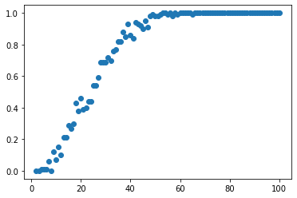

# Birthday Problem (Paradox) Simulation

<b> The problem:</b> In probability theory, the birthday problem (also called birthday paradox) asks for the probability that, in a set of n randomly chosen people, at least two will share a birthday. 

<b> The fact:</b> The birthday problem is that, counterintuitively, the probability of a shared birthday exceeds 50% in a group of only 23 people.

The birthday problem asks for an approximate probability that in a group of n people at least two have the same birthday, and  it is assumed that there are 365 possible birthdays, and that each person's birthday is equally likely to be any of these days, independent of the other people in the group.

Interestingly, in a room of 50 there’s a 97% chance of at least two people matching!

<b>Here is the math behind it:</b> Let the 23 people be numbered 1 to 23. The event that all 23 people have different birthdays is the same as the event that person 2 does not have the same birthday as person 1, and that person 3 does not have the same birthday as either person 1 or person 2, and so on, and finally that person 23 does not have the same birthday as any of persons 1 through 22. Let these events be called Event 2, Event 3, and so on. Event 1 is the event of person 1 having a birthday, which occurs with probability 1. This conjunction of events may be computed using conditional probability: the probability of Event 2 is 364/365, as person 2 may have any birthday other than the birthday of person 1. Similarly, the probability of Event 3 given that Event 2 occurred is 363/365, as person 3 may have any of the birthdays not already taken by persons 1 and 2. This continues until finally the probability of Event 23 given that all preceding events occurred is 343/365. Finally, the principle of conditional probability implies that P(A′) is equal to the product of these individual probabilities:

${\displaystyle P(A')={\frac {365}{365}}\times {\frac {364}{365}}\times {\frac {363}{365}}\times {\frac {362}{365}}\times \cdots \times {\frac {343}{365}}}$ (1)

The terms of equation (1) can be collected to arrive at:

${\displaystyle P(A')=\left({\frac {1}{365}}\right)^{23}\times (365\times 364\times 363\times \cdots \times 343)}$ (2)

Evaluating equation (2) gives P(A′) ≈ 0.492703

Therefore, P(A) ≈ 1 − 0.492703 = 0.507297 (50.7297%).

Let's simulate this!


```python
import numpy as np
rand_state = np.random.RandomState(42)
```


```python
def bday_problem(population,loop):
   
    #number of desired outcomes, ie if there are 2 people with the same birthdate
    count = 0
    
    #how many times we will simulate, loop
    for i in range(loop):
        
        #flag for the same birthdates, same is default false
        same = False
        
        #choose random intereger between 0 and 364, representing a birthdate, and create a list for everyones birthdate
        days=[rand_state.randint(365) for p in range(population)]
        
        #check if there are duplicates in the days list, if there are same becames true and we increase counter
        if len([x for x in days if days.count(x) > 1]) > 0:
            same = True
            count += 1
            
    return (round(count/loop,2), 'There are {} cases out of {} trials where at least 2 people share birthdays.\
    The probability is {:.2f}'.format(count, loop, count/loop))
```

Let's calculate the probability in a group of 23 people!


```python
prob, result = bday_problem(23,1000)
result
```


    'There are 515 cases out of 1000 trials where at least 2 people share birthdays.    The probability is 0.52'


What about 50 people?


```python
prob, result = bday_problem(50,1000)
result
```


    'There are 975 cases out of 1000 trials where at least 2 people share birthdays.\nThe probability of having a pair among 50 people is 0.975'


Let's do some graph! Starting from 2 people up to 100, we will see how probabilities change.


```python
x = np.arange(2,101)
probs=[]
for pop in x:
    prob, result = bday_problem(pop,100)
    probs.append(prob)
```


```python
plt.scatter(x,probs)
plt.show
```


    <function matplotlib.pyplot.show(close=None, block=None)>


    

    


```python
from scipy.interpolate import make_interp_spline

X_Y_Spline = make_interp_spline(x, probs)
 
# Returns evenly spaced numbers
# over a specified interval.
X_ = np.linspace(x.min(), x.max(),20)
Y_ = X_Y_Spline(X_)

fig, ax = plt.subplots()

ax.plot(X_, Y_, linewidth=3.0)
plt.axvline(x=50, c='r')

plt.show()
```


    

    


So, as the number of people increases in the group, the probability of having a sharing birthday increases. After 50 people, the probability becomes almost 1!
