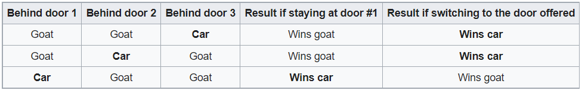
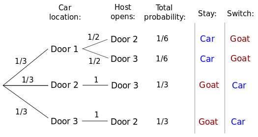
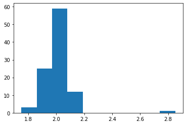
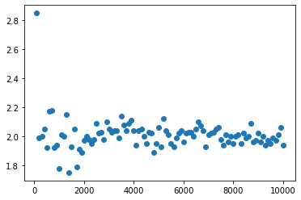
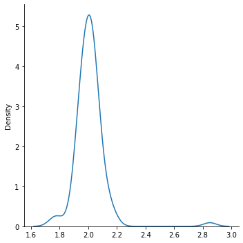

# Monty Hall Problem Simulation

<b> The problem:</b> Suppose you're on a game show, and you're given the choice of three doors: Behind one door is a car; behind the others, goats. You pick a door, say No. 1, and the host, who knows what's behind the doors, opens another door, say No. 3, which has a goat. He then says to you, "Do you want to switch from door No.1 to No. 2?" Is it to your advantage to switch your choice?

<b> The optimal strategy:</b> The contestant should switch to the other door.Under the standard assumptions, the switching strategy has a $\frac{2}{3}$ probability of winning the car, while the strategy that remains with the initial choice has only a $\frac{1}{3}$ probability. By switching, contestant doubles his/her winning chance.

<u>Simple solution:</u>, The three possible arrangements of one car and two goats behind three doors and the result of staying or switching after initially picking door 1 in each case is shown below:



A player who stays with the initial choice wins in only one out of three of these equally likely possibilities, while a player who switches wins in two out of three. 

<b>Here is the math behind it:</b>

By definition, the conditional probability of winning by switching given the contestant initially picks door 1 and the host opens door 3 is the probability for the event "car is behind door 2 and host opens door 3" divided by the probability for "host opens door 3". These probabilities can be determined referring to the conditional probability table, or to an equivalent decision tree as shown below. The conditional probability of winning by switching is $\frac{\frac{1}{3}}{\frac{1}{3}+\frac{1}{6}} = \frac{2}{3}$.




```python
import numpy as np
rand_state = np.random.RandomState(42)
```


```python
def monty_hall(num_games, num_door):
    sticked_win = 0
    switched_win = 0
    
    for i in range(num_games):
        #host has not offered any door yet
        host = 0
        
        # car location
        car_loc = rand_state.randint(num_door) + 1
        
        #player's door
        player = rand_state.randint(num_door) + 1   
        
        #if player picks a door with a goat then, host needs to offer the door with the car behind:
        if player != car_loc:
            host = car_loc
            #If player switches to host's offer, s/he wins:
            player = host
            switched_win += 1
        
        #if player picks the door with the car and switches, s/he is going to lose anyway.
        else:
        #if player picks a door and doesn't switch:
            sticked_win += 1
            
    ratio = round(switched_win/sticked_win,2)
    
    return (ratio,'Player has switched and won {} times and player sticked and won {} times. The ratio is {:.2f}.'.format(switched_win,sticked_win,ratio))
```

Let's say we have 3 doors and we simulate this for 10,000 times.


```python
chance, result = monty_hall(10000,3)
result
```


    'Player has switched and won 6661 times and player sticked and won 3339 times. The ratio is 1.99.'


So, this proves that we double our winning chance by switching.

Let's do some graph! Starting from 100 trials up to 10,000, we will see how our winning chance changes.


```python
x = np.arange(100,10001,100)
chances=[]
for trial in x:
    chance, result = monty_hall(trial,3)
    chances.append(chance)
```


```python
import matplotlib.pyplot as plt
plt.hist(chances)
plt.show()
```


    

    


```python
plt.scatter(x,chances)
plt.show
```


    <function matplotlib.pyplot.show(close=None, block=None)>


    

    


```python
import seaborn as sns
sns.displot(chances, kind="kde")
```


    <seaborn.axisgrid.FacetGrid at 0x1e789d47b20>


    

    


As you see, all these graphs shows that we double our winning chance by switching!

Let's see what happen's if we have 4 doors in this game with the assumption that the host opens every other door with the goat behind it!


```python
chance, result = monty_hall(10000,4)
result
```


    'Player has switched and won 7491 times and player sticked and won 2509 times. The ratio is 2.99.'


So, it seems switching almost triples our winning chance!


```python
for i in range(4,11):
    chance, result = monty_hall(100000,i)
    print(result)
```

    Player has switched and won 74725 times and player sticked and won 25275 times. The ratio is 2.96.
    Player has switched and won 80030 times and player sticked and won 19970 times. The ratio is 4.01.
    Player has switched and won 83395 times and player sticked and won 16605 times. The ratio is 5.02.
    Player has switched and won 85996 times and player sticked and won 14004 times. The ratio is 6.14.
    Player has switched and won 87489 times and player sticked and won 12511 times. The ratio is 6.99.
    Player has switched and won 88957 times and player sticked and won 11043 times. The ratio is 8.06.
    Player has switched and won 90074 times and player sticked and won 9926 times. The ratio is 9.07.
    

As you see, as the number of door increases in the game, switching the door tremendously increases our winning chance!
