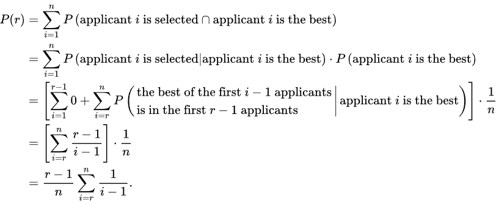
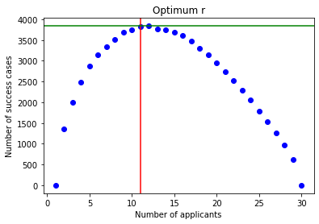

# Secretary/Best Choice Problem Simulation

<b> The problem:</b> You are the HR manager of a company and need to hire the best secretary out of a given number N of candidates. You can interview them one by one, in random order. However, the decision of appointing or rejecting a particular applicant must be taken immediately after the interview. If nobody has been accepted before the end, the last candidate is chosen. What strategy do you use to maximize the chances to hire the best applicant?

<b> The optimal strategy:</b> The interviewer rejects the first r − 1 applicants (let applicant M be the best applicant among these r − 1 applicants), and then selects the first subsequent applicant that is better than applicant M.

<u>For example</u>, if you have 20 applicants, and you choose to reject first 5 of them. Let's say the best one among those 5 was the 3rd candidate. Then you start interviewing the rest of candidates one by one, until you find someone better than the 3rd and hire that person, say the 9th candidate. So, you do not need to interview other 11 candidates. However, is the 9th candidate really the best one among all 20 candidates? 

We will be using the cut-off rule form the <b>optimal stopping theory</b>. In mathematics, the theory of optimal stopping or early stopping is concerned with the problem of choosing a time to take a particular action, in order to maximise an expected reward or minimise an expected cost. 

<b>Here is the math behind it:</b>



<b>The cut-off rule:</b> P(r) is maxed when P'(r)=0, which yields, r ~ N/e ~ N*0.368

If you have 100 candidates, the optimal 'r' would be 37. It means, you need to interview and reject the first 37 candidates, and hire the next best one.

I will write a code to simulate this problem and find the optimal 'r', then compare the results to see if it matches with the theoretical solution!


```python
import numpy as np
rand_state = np.random.RandomState(42)
```


```python
def best_choice(num_applicant, num_trials):
    
    #initialize a list that will record success cases
    list_success=[0 for s in range(num_applicant)]
    
    for trial in range(num_trials):
        #possible ratings/rankings for all candidates, 
        ratings = [i+1 for i in range(num_applicant)]

        #assigning these ratings randomly to all candidates
        rand_state.shuffle(ratings)    
        #print('ratings matrix: ', ratings)


        #initialize the ratings of the best candidate up to rth candidate and the rest of the candidates
        max_to_r = 0
        max_rest = 0
        

        #trying out all r values starting from 1 to number of candidates
        for r in range(1,num_applicant-1):

            #rating of the best cadidate among the first r candidate
            max_to_r = max(ratings[:r])

            #the rating of the hired person
            rating_of_hired = 0

            #rating of the best cadidate among the rest of candidates
            max_rest = max(ratings[r:])

            #find the next best candidate among the rest of the candidates   
            for rate in ratings[r:]:
                if rate > max_to_r:
                    rating_of_hired = rate
                    break        

            #did we hire the best candidate among all?
            success = 0
            if rating_of_hired == max(ratings):
                success += 1
                list_success[r] += 1
                
    optimum_r = list_success.index(max(list_success))
    
    ratio = round(optimum_r/num_applicant,3)
    
    return (list_success, 'The optimum r is {} and the ratio is {:.3f}'.format(optimum_r, ratio))
```

Let's say we have 30 applicants and we simulate this for 10,000 times.


```python
number_of_applicants = 30
number_of_trials = 10000
optimums, result = best_choice(number_of_applicants,number_of_trials)
result
```


    'The optimum r is 11 and the ratio is 0.367'


It is very close! Let's graph our results


```python
import matplotlib.pyplot as plt

x = [i+1 for i in range(number_of_applicants)]
y = optimums

plt.scatter(x, y, c ="blue")
plt.axvline(x=0.368*number_of_applicants, c='r')
plt.axhline(max(optimums), c='g')
plt.xlabel('Number of applicants')
plt.ylabel('Number of success cases')
plt.title('Optimum r')

# To show the plot
plt.show()
```


    

    


So, for 30 candidates, we need to interview the first 11 of them and record the best one's rating, say M, and reject all 11. Then, starting from the 12th one, whoever is better than M will be hired. This strategy has a success rate of 37%.

Let's say we have 30 applicants and we simulate this for 10,000 times.


```python
number_of_applicants = 68
number_of_trials = 10000
optimums, result = best_choice(number_of_applicants,number_of_trials)
result
```


    'The optimum r is 25 and the ratio is 0.368'


That is what we are looking for!
